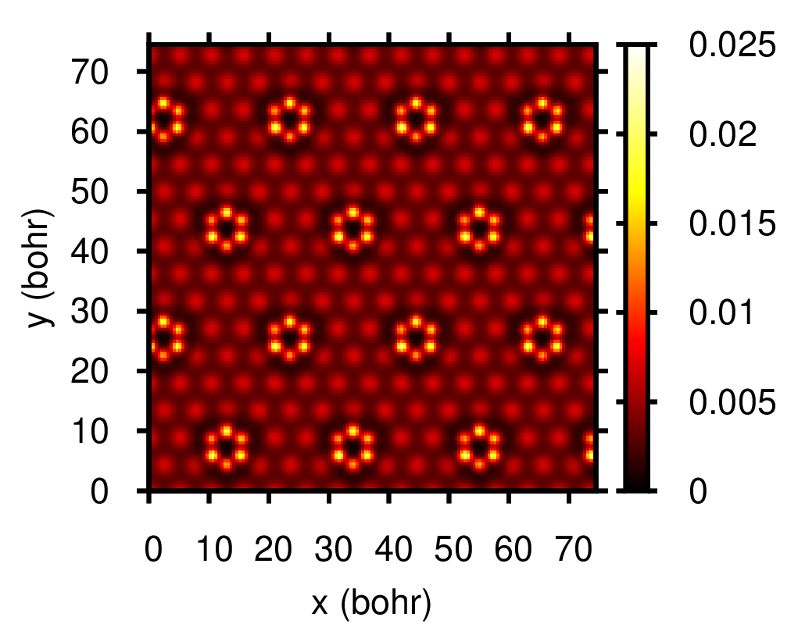
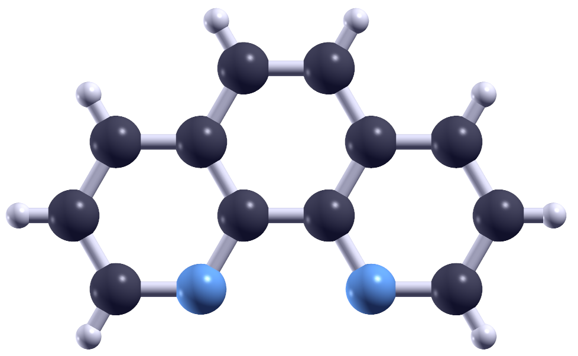

## Research Overview

My work is centered on understanding how structural properties of surfaces influence their electronic and magnetic behavior.

---

## Main Research Topics

### Surface Science

Investigation of atomic-scale structure and its impact on physical properties, especially in low-dimensional systems.

---

### Two-Dimensional Materials and Nanostructures

Study of materials such as graphene, hexagonal boron nitride, and transition metal dichalcogenides, including supported systems.

---

### Experimental Techniques

- X-ray Photoelectron Spectroscopy (XPS)
- X-ray Photoelectron Diffraction (XPD)
- Angle-Resolved Photoemission Spectroscopy (ARPES)
- Scanning Tunneling Microscopy and Spectroscopy (STM/STS)

---

### Computational Methods

Use of Density Functional Theory (DFT) to:

- Calculate electronic structure
- Simulate STM images
- Support and interpret experimental results

## Selected Results

<!--

### STM Imaging

{width=50% fig-align="center"}

Atomic-resolution STM image of a surface structure.

---

### DFT Structure

{width=50% fig-align="center"}

First-principles optimized structure of a supported nanostructure.

-->
